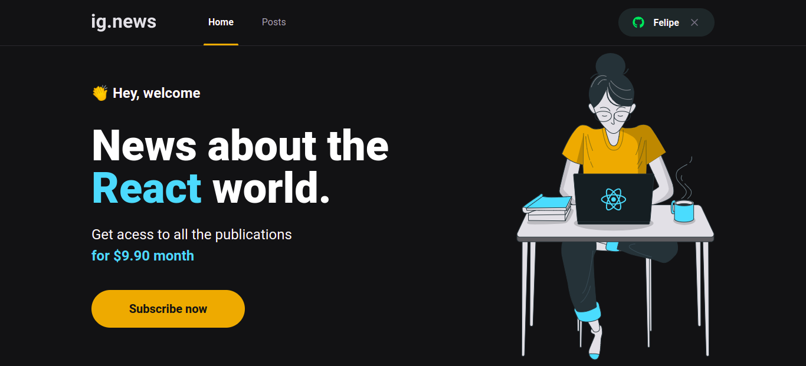

# Ignews



## Introdução.

O Ignews é uma aplicação de notícias sobre react onde é permitida leitura parcial dos posts de forma gratuita ou leitura de todo o post mediante uma assinatura.

O usário deve fazer login usando sua conta no github independente de ser ou não assinante do ignews.

A assinatura é mensal e pode ser paga por meio de cartão de crédito.

## Objetivo do projeto.
Objetivo aqui é aprender sobre o next com uma aplicação que utiliza diversos recursos do nextjs.

## Detalhes técnicos.

### Typescript

Foi adicionado o pacote typescript juntamente com os pacotes @types/react e @types/node como de desenvolvimento.

### SSR detalhes importantes.

Apenas os componentes que são páginas podem fazer uma chamada à api usando **server side rendering**, caso um componente precise de informações dessa requisição terá de ser repassada pela página.

devemos exportar uma função de nome **getServerSideProps** sempre assíncrona, mesmo que não use o await nela e aplicamos o tipo **GetServerSideProps** importado do **next**

### SSG

Essse método de geração de arquivos estáticos, usando **getStaticProps**, irá fazer as chamadas a api necessárias e construir o html a ser devolvido para o cliente, porém além de enviar a resposta ao cliente na primeira requisição são gerados arquivos estáticos, que serão devolvidos de imediato nas próximas requisições.  
Este método retorna, igualmente ao getServerSideProps, um objeto que além de conter **props**, dentre outras propriedades contém a **revalidate** que pode ser usada com o típo número informando os segundos que a página pode esperar para ser atualizada automaticamente.  
Embora exista esse recurso é importante destacar que ele não deve ser usado para páginas que terão dados personalizados, já que os arquivos serão criados estaticamente.

### Client-side

É importante notar que existe ainda a possibilidade de chamadas à api de dentro do componente, usando useEffect por exemplo. Às vezes pode ser mais interessante usar esse tipo de renderização para que o layout não tenha que esperar o processamento de uma chamada à api **SSG** que é muito custosa para o servidor.

### Chamadas à api do stripe

Usei o pacote do **stripe** para fazer as chamadas à api ``` yarn add stripe ```
Para mais detalhes consulte a documentação [clicando aqui](https://stripe.com/docs/api)

### Backend no nextjs

Ao criar uma pasta **api** dentro de **pages** qualquer os arquivos dentro dessa pasta serão rotas, desde que sejam arquivos válidos como **\*.ts \*.js** por exemplo.

### Faunadb

Para interagir melhor com um backend server less foi utilizado o faunadb juntamente com seu sdk ```yarn add faunadb```. Para mais informações inclusive sobre a linguagem para interagir com o banco de dados [veja a documentação do fauna](https://docs.fauna.com/fauna/current/);

#### FQL

Antes de usar o fql é importante instanciar a classe **Client** de dentro do faunadb passando a chave secreta do fauna informada em um arquivo .env, segue o exemplo:

```
import { Client } from "faunadb";

export const fauna = new Client({
   secret: process.env.FAUNADB_KEY
})
```
Em fim, para usar o fql importe **query** de dentro do **faunadb** para usar em conjunto com a instância da classe **Client**.

### Variáveis de ambiente públicas

Para tornar uma variável de ambiente pública no next é importante lembrar de usar **NEXT_PLUBLIC_NOME_DA_VARIÁVEL**.  
É muito importante ter cuidado com certas variáveis, pois algumas, acredito a maioria, **jamais** devem ser acessíveis no frontend.

### Variáveis de ambiente no next

Quando necessitamos executar uma ação pelo usuário, que necessite de uma variável de ambiente que deva ser protegida temos no **next** três opções:
* **getServerSideProps (SSR)**
* **getStaticProps (SSG)**
* **API routes**

Todas essas formas executam do lado do servidor sendo que **API routes** para esse caso é a melhor, pois nos dá a possibilidade de criar uma rota que pode ser consumida por outros componentes de nossa aplicação.

### Webhooks

Webhook é uma forma de ouvir eventos de uma aplicação terceira para atualizar a nossa aplicação, possibilitando atualizar status de clientes, mensagens cadastros, etc.  
A partir dessas informações podemos determinar como nossa aplicação irá se comportar.  
Neste projeto usaremos webhooks do stripe. Para mais detalhes [consulte a documentação](https://stripe.com/docs/webhooks).
